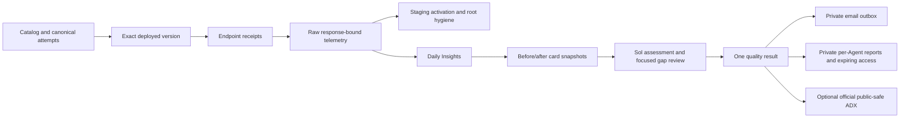

# Framework overview

The benchmark's primary output is an actionable, evidence-backed Agent Insights quality gap.
A score summarizes the measured cases; it is not proof of universal production quality.

## Responsibilities

| Layer | Responsibility |
| --- | --- |
| Catalog and traffic | Five Agents, 36 reviewed single-root issues and canonical ten-attempt scenarios |
| Local tests | Pure domain checks and explicit real Hosted-framework/in-memory tracing checks |
| Staging | Changed-target deployed execution, expected activation and scoped single-root hygiene; no Insights generation |
| Daily | Five concurrent lanes, baseline plus four issues per Agent, trace readiness, Insights and final assessment |
| Sol assessment | Interpret independent endpoint/raw-span evidence and review candidate gaps |
| Results | One score and coverage model; numeric coverage/exclusions in reports, not visible Full/Partial labels |
| Runtime state | Per-turn/per-stage checkpoints, safe retries and direct last-test references |
| Events/publication | Durable local logs, private per-Agent report archive/access, and independent optional public-safe ADX outbox |
| App automation | Launch the runner; send only its exact prepared email and record the actual outcome |

## Data flow

Python publishes immutable reports to existing private Storage and binds approved access links
to the prepared email. Generated reports never create Git branches, PRs or merges. TEST has no
ADX/public-report writes or team mail. Historical public reports remain unchanged.

The three [repository skills](../README.md#skills) only select the source-maintenance,
staging or Daily workflow. Catalogs own inventory, [quality rules](QUALITY_BAR.md) own evidence
and scoring contracts, and [operations](OPERATIONS.md) own commands and recovery guidance.
Skills and app prompts do not orchestrate units or reinterpret model judgments.

Staging retains expected-defect observations separately from additional findings. The
[versioned hygiene policy](QUALITY_BAR.md#scoped-single-root-hygiene) distinguishes independent
extra Agent defects, same-root consequences, handled operational behavior and unresolved
material candidates. Missing evidence does not establish either a defect or clean hygiene.

An operation ID is a distributed trace scope, not necessarily one invocation. The collector starts
from actual endpoint response identities, fetches matching operations, and preserves raw records
with an invocation membership index. Unexpected records, query gaps and cumulative card links are
not silently discarded.

Travel's `travel.model.review` span is an internal concision review, not the delivered response.
Its model request includes the external user request and the candidate response; the actual
review output remains in telemetry with `travel.review.output_delivered=false`. The hosting
invocation records the real endpoint output. Neither the collector nor assessment should
replace one surface with the other or discard a genuine internal cost/latency observation.
Healthcare appointment listings distinguish existing records from evidence of open availability
and retain the supplied in-scope record identifiers.

Support invocation spans retain the original caller input/history alongside the delivered output.
This preserves the distinction between explicitly requested recovery/fallback cases and an
unexpected operational failure; model-summary inputs cannot substitute for the caller's request.

Private runtime records and public result models are different objects. No raw provider payload,
trace, credential, work item or private identifier belongs in the public model.
