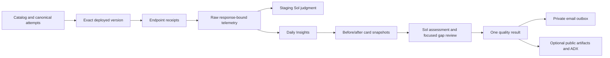

# Framework overview

The benchmark's primary output is an actionable, evidence-backed Agent Insights quality gap.
A score summarizes the measured cases; it is not proof of universal production quality.

## Responsibilities

| Layer | Responsibility |
| --- | --- |
| Catalog and traffic | Five Agents, 36 reviewed single-root issues and canonical ten-attempt scenarios |
| Local tests | Pure domain checks and explicit real Hosted-framework/in-memory tracing checks |
| Staging | Changed-target deployed execution and raw-evidence qualification; no Insights generation |
| Daily | Five concurrent lanes, baseline plus four issues per Agent, trace readiness, Insights and final assessment |
| Sol assessment | Interpret independent endpoint/raw-span evidence and review candidate gaps |
| Results | One score and Full/Partial coverage model for all renderers and publishers |
| Runtime state | Per-turn/per-stage checkpoints, safe retries and direct last-test references |
| Events/publication | Durable local logs and optional public-safe ADX outbox |
| App automation | Launch the runner; send only its exact prepared email and record the actual outcome |

## Data flow

An operation ID is a distributed trace scope, not necessarily one invocation. The collector starts
from actual endpoint response identities, fetches matching operations, and preserves raw records
with an invocation membership index. Unexpected records, query gaps and cumulative card links are
not silently discarded.

Travel's `travel.model.review` span is an internal concision review, not the delivered response.
Its model request includes the external user request and the candidate response; the actual
review output remains in telemetry with `travel.review.output_delivered=false`. The hosting
invocation records the real endpoint output. Neither the collector nor assessment should
replace one surface with the other or discard a genuine internal cost/latency observation.
Healthcare appointment listings distinguish existing records from evidence of open availability
and retain the supplied in-scope record identifiers.

Private runtime records and public result models are different objects. No raw provider payload,
trace, credential, work item or private identifier belongs in the public model.
