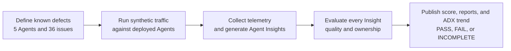

# Agent Insights Quality Test Framework

## 60-second explanation

This framework continuously measures whether Agent Insights detects known Agent defects accurately, completely, and without noise. Five real deployed test Agents exercise Prompt, Microsoft Agent Framework, LangGraph, and custom AgentServer patterns. Every issue is a reviewed single-root defect with deterministic synthetic traffic and an expected Insight contract. The framework invokes deployed endpoints, waits for natural telemetry, verifies trace provenance, runs Agent Insights, and then uses GPT-5.6 Sol to evaluate each generated Insight card and assign ownership. Complete runs receive a field-weighted quality score; operationally incomplete runs never become product failures. Staging validates all 36 issues before a reviewed Agent set is promoted once to daily. Weekday daily runs reuse the deployed versions and test five issues per Agent without redeploying. Authorized operators share the same deployed environment through Entra-authenticated registry blobs that synchronize into a private local runtime cache before traffic.

Weather and Healthcare are pure Prompt controls: they use request-provided synthetic evidence, never
declare function tools or fixtures, and permit response continuation only for intentional memory
turns. Baseline decisions require deterministic semantic coverage, full-request proof, and terminal
output evidence; a card-linked intermediate operation cannot override contradictory full-request
evidence.

## High-level flow

## Five Test Agents

| Agent | Owner | Foundry type | Implementation | Assigned issues |
| --- | --- | --- | --- | --- |
| weather-agent | Billy Hu | Prompt | Foundry Prompt Agent | [issue-001](https://github.com/ninghu/agent-insights-quality/blob/main/ISSUE_CATALOG.md#issue-001), [issue-002](https://github.com/ninghu/agent-insights-quality/blob/main/ISSUE_CATALOG.md#issue-002), [issue-003](https://github.com/ninghu/agent-insights-quality/blob/main/ISSUE_CATALOG.md#issue-003), [issue-004](https://github.com/ninghu/agent-insights-quality/blob/main/ISSUE_CATALOG.md#issue-004), [issue-005](https://github.com/ninghu/agent-insights-quality/blob/main/ISSUE_CATALOG.md#issue-005), [issue-006](https://github.com/ninghu/agent-insights-quality/blob/main/ISSUE_CATALOG.md#issue-006) |
| healthcare-agent | Ilya Matiach | Prompt | Foundry Prompt Agent | [issue-007](https://github.com/ninghu/agent-insights-quality/blob/main/ISSUE_CATALOG.md#issue-007), [issue-008](https://github.com/ninghu/agent-insights-quality/blob/main/ISSUE_CATALOG.md#issue-008), [issue-009](https://github.com/ninghu/agent-insights-quality/blob/main/ISSUE_CATALOG.md#issue-009), [issue-010](https://github.com/ninghu/agent-insights-quality/blob/main/ISSUE_CATALOG.md#issue-010), [issue-011](https://github.com/ninghu/agent-insights-quality/blob/main/ISSUE_CATALOG.md#issue-011), [issue-012](https://github.com/ninghu/agent-insights-quality/blob/main/ISSUE_CATALOG.md#issue-012) |
| finance-agent | Han Che | Hosted code | Microsoft Agent Framework | [issue-013](https://github.com/ninghu/agent-insights-quality/blob/main/ISSUE_CATALOG.md#issue-013), [issue-014](https://github.com/ninghu/agent-insights-quality/blob/main/ISSUE_CATALOG.md#issue-014), [issue-015](https://github.com/ninghu/agent-insights-quality/blob/main/ISSUE_CATALOG.md#issue-015), [issue-016](https://github.com/ninghu/agent-insights-quality/blob/main/ISSUE_CATALOG.md#issue-016), [issue-017](https://github.com/ninghu/agent-insights-quality/blob/main/ISSUE_CATALOG.md#issue-017), [issue-018](https://github.com/ninghu/agent-insights-quality/blob/main/ISSUE_CATALOG.md#issue-018), [issue-019](https://github.com/ninghu/agent-insights-quality/blob/main/ISSUE_CATALOG.md#issue-019), [issue-020](https://github.com/ninghu/agent-insights-quality/blob/main/ISSUE_CATALOG.md#issue-020) |
| travel-agent | Sean Gayler | Hosted code | LangGraph | [issue-021](https://github.com/ninghu/agent-insights-quality/blob/main/ISSUE_CATALOG.md#issue-021), [issue-022](https://github.com/ninghu/agent-insights-quality/blob/main/ISSUE_CATALOG.md#issue-022), [issue-023](https://github.com/ninghu/agent-insights-quality/blob/main/ISSUE_CATALOG.md#issue-023), [issue-024](https://github.com/ninghu/agent-insights-quality/blob/main/ISSUE_CATALOG.md#issue-024), [issue-025](https://github.com/ninghu/agent-insights-quality/blob/main/ISSUE_CATALOG.md#issue-025), [issue-026](https://github.com/ninghu/agent-insights-quality/blob/main/ISSUE_CATALOG.md#issue-026), [issue-027](https://github.com/ninghu/agent-insights-quality/blob/main/ISSUE_CATALOG.md#issue-027), [issue-028](https://github.com/ninghu/agent-insights-quality/blob/main/ISSUE_CATALOG.md#issue-028) |
| support-ticket-agent | Nishal Dsilva | Hosted container | Foundry Responses AgentServer | [issue-029](https://github.com/ninghu/agent-insights-quality/blob/main/ISSUE_CATALOG.md#issue-029), [issue-030](https://github.com/ninghu/agent-insights-quality/blob/main/ISSUE_CATALOG.md#issue-030), [issue-031](https://github.com/ninghu/agent-insights-quality/blob/main/ISSUE_CATALOG.md#issue-031), [issue-032](https://github.com/ninghu/agent-insights-quality/blob/main/ISSUE_CATALOG.md#issue-032), [issue-033](https://github.com/ninghu/agent-insights-quality/blob/main/ISSUE_CATALOG.md#issue-033), [issue-034](https://github.com/ninghu/agent-insights-quality/blob/main/ISSUE_CATALOG.md#issue-034), [issue-035](https://github.com/ninghu/agent-insights-quality/blob/main/ISSUE_CATALOG.md#issue-035), [issue-036](https://github.com/ninghu/agent-insights-quality/blob/main/ISSUE_CATALOG.md#issue-036) |

## Full Issue Catalog

[Open the complete Agent Insights Quality Issue Catalog](https://github.com/ninghu/agent-insights-quality/blob/main/ISSUE_CATALOG.md)
