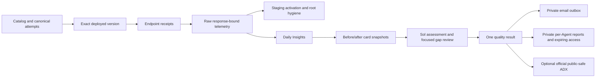

# Framework overview

The benchmark's primary output is an actionable, evidence-backed Agent Insights quality gap.
A score summarizes the measured cases; it is not proof of universal production quality.

## Responsibilities

| Layer | Responsibility |
| --- | --- |
| Catalog and traffic | Five Agents, 40 reviewed single-root issues and canonical ten-attempt scenarios |
| Local tests | Pure domain checks and explicit real Hosted-framework/in-memory tracing checks |
| Staging | Changed-target deployed execution, expected activation and scoped single-root hygiene; no Insights generation |
| Daily | Five concurrent lanes, baseline plus four issues per Agent, trace readiness, Insights and final assessment |
| Sol assessment | Interpret independent endpoint/raw-span evidence and review candidate gaps |
| Results | One score and coverage model; numeric coverage/exclusions in reports, not visible Full/Partial labels |
| Runtime state | Per-turn/per-stage checkpoints, safe retries and direct last-test references |
| Events/publication | Durable local logs, private per-Agent report archive/access, and independent optional public-safe ADX outbox |
| App automation | Launch the runner; send only its exact prepared email and record the actual outcome |

## Data flow

Python publishes immutable reports to existing private Storage and binds approved access links
to the prepared email. Generated reports never create Git branches, PRs or merges. TEST has no
ADX/public-report writes or team mail. Historical public reports remain unchanged.

The three [repository skills](../README.md#skills) only select the source-maintenance,
staging or Daily workflow. Catalogs own inventory, [quality rules](QUALITY_BAR.md) own evidence
and scoring contracts, and [operations](OPERATIONS.md) own commands and recovery guidance.
Skills and app prompts do not orchestrate units or reinterpret model judgments.

Staging retains expected-defect observations separately from additional findings. The
[versioned hygiene policy](QUALITY_BAR.md#scoped-single-root-hygiene) distinguishes independent
extra Agent defects, same-root consequences, handled operational behavior and unresolved
material candidates. Missing evidence does not establish either a defect or clean hygiene.

An operation ID is a distributed trace scope, not necessarily one invocation. The collector starts
from actual endpoint response identities, fetches matching operations, and preserves raw records
with an invocation membership index. Unexpected records, query gaps and cumulative card links are
not silently discarded.

Travel uses one bounded model call to produce its final wording, not an unused private review.
The model chooses state-derived factual phrasings and sentence order, returning the complete
plain-text answer. Independent local validation requires exactly one permitted phrasing of
every selected fact, with no missing, duplicated, foreign or contradictory statements.
Accepted model text is delivered verbatim; invalid or incomplete output fails explicitly,
without another model call, truncation or a success-shaped deterministic fallback. The
`gpt-5.4-mini` default and 200-output-token budget remain unchanged; SDK retries are disabled
and the request timeout is 60 seconds. Neutral setup acknowledgments do not invoke the model.

This finite grammar constrains language, not the correctness of the preceding business
decision. Rendering reflects the version's actual selected inventory, itinerary and booking
outcome; it does not repair an injected fabricated result, wrong tool, omitted search,
overfetch, early booking, dropped itinerary, serialized search or stale state. Raw tool/state
evidence remains necessary to judge those defects. Extra inventory still reaches the model
in the overfetch version even though it is unnecessary for the selected answer.

The `travel.model.answer` span separately retains trusted instructions, the caller request
as JSON data, selected state, permitted factual phrasings, the complete returned model
content and provider-reported usage. `travel.render.internal=false` identifies its intended
final-answer role; `travel.render.output_validated` records acceptance, not endpoint delivery.
Only the hosting invocation's `response.completed` path sets
`travel.response.output_delivered=true` and records the actual endpoint message. This is a
host-completion observation, not independent client-receipt proof. Failed raw model output
is retained rather than relabeled as delivered. Existing historical judgments are unchanged;
the new path still needs deployed qualification and evidence review.

Healthcare appointment listings distinguish existing records from evidence of open availability
and retain the supplied in-scope record identifiers.

Support invocation spans retain the original caller input/history alongside the delivered output.
This preserves the distinction between explicitly requested recovery/fallback cases and an
unexpected operational failure; model-summary inputs cannot substitute for the caller's request.

Private runtime records and public result models are different objects. No raw provider payload,
trace, credential, work item or private identifier belongs in the public model.
